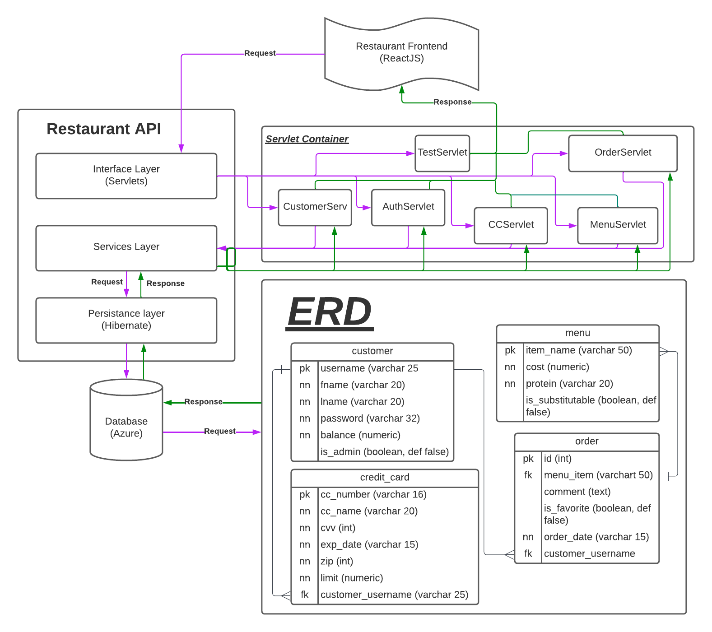

# **Project 1:** Ross and Jerry's Restaurant Application - **_DUE: 06/06/22_**

## Description

Ross and Jerry's Restaurant was developed as a small restaurant that is looking to help streamline the ordering process for customers to help reduce costs. Customers can enjoy an seamless means to order directly with an account of their own at the restaurant in question, where Admins are capable of adding and updating the menu items. This RESTful application leverages a tomcat server to handle incoming requests to thoroughly tested services that must be persisted using Hibernate and Azure SQL services. This project includes a front-end that will be developed using ReactJS to handle user requests.

# User Stories

## As A: Admin

-   [ ] Add items to the menu
-   [ ] Update items to the menu
-   [ ] Delete items to the menu

## As A: Customer

-   [ ] View all items on the menu without needing to Register or Login
-   [ ] Register/Update/Delete an account
-   [ ] Add/Update/Delete a credit card to be saved to my account
-   [ ] Make an order for a specific menu item
-   [ ] Add a comment to the order to request a change, if it is substitutable
-   [ ] Favorite an order
-   [ ] View past orders by date
-   [ ] Pay off your balance with your credit card

## Required Challenge:

In this project, we are challenge to learn and implement the use of Hibernate and ORM for java. Below are resources given by our professor that can help with understanding how to leverage hibernate in our project. 

-   [What is an ORM and Why You Should Use It](https://blog.bitsrc.io/what-is-an-orm-and-why-you-should-use-it-b2b6f75f5e2a)

-   [Hibernate Documentation](https://hibernate.org/orm/documentation/5.4/)

-   [JPA and Hibernate](https://www.baeldung.com/jpql-hql-criteria-query)

-   [Tutorialspoint Hibernate](https://www.tutorialspoint.com/hibernate/index.htm)

-   [Hibernate Session Factory](https://www.java2novice.com/hibernate/session-factory/)

## Tech Stack

-   [ ] Java 8
-   [ ] JUnit
-   [ ] Mockito
-   [ ] Apache Maven
-   [ ] Hibernate
-   [ ] Jackson library (for JSON marshalling/unmarshalling)
-   [ ] Java EE Servlet API (v4.0+)
-   [ ] Azure SQL
-   [ ] ReactJS Frontend
-   [ ] Git SCM (on GitHub)
-   [ ] Azure WebApps 

## Functional Requirements

-   [ ] CRUD operations are supported for one or more domain objects via the web application's exposed endpoints
-   [ ] JDBC logic is abstracted away by hibernate
-   [ ] Programmatic persistence of entities (basic CRUD support) using hibernate

## Project Structure

## Collaborators
- Jerry Faustin
- Seyedrasool Sadrieh

